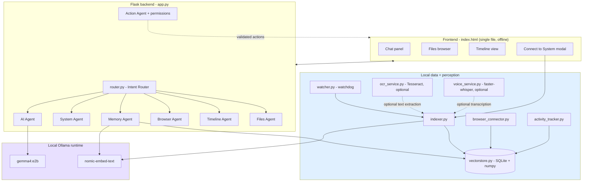
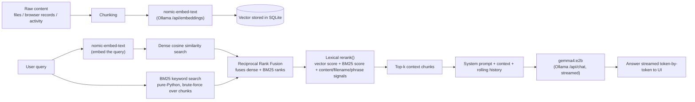
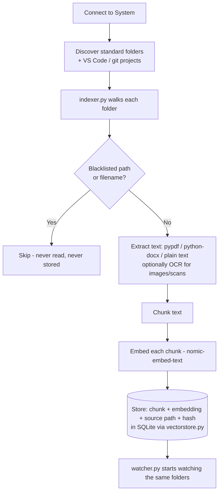
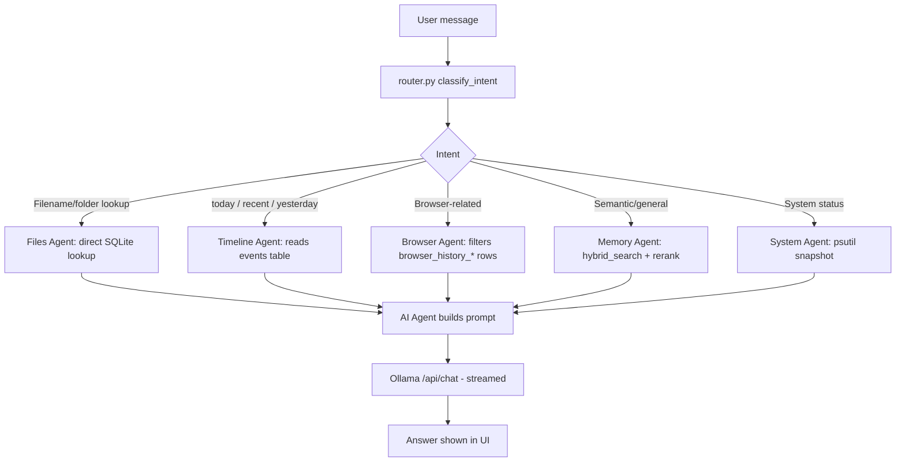

# GhostOS — Architecture

This document covers the system diagram, model pipeline, data flow, local/cloud component split, and the key design decisions behind GhostOS.

---

## 1. System Diagram

Everything below the frontend runs as local processes on the user's machine. There is no cloud tier in this diagram — see [§4](#4-localcloud-component-split) for why that's a hard boundary, not just a default.

---

## 2. Model Pipeline

GhostOS uses two local models via Ollama, plus a non-neural reranking step:

**Why RRF instead of averaging scores directly:** cosine similarity (roughly 0–1) and BM25 (unbounded) live on incompatible scales, so averaging them would let whichever score happens to be numerically larger dominate. RRF sidesteps that by only caring about each result's *rank* in each list, not its raw score.

**Why a lexical reranker instead of a neural one:** GhostOS's only two models are the embedder and the chat model — there's no dedicated reranking model in the stack. Instead, `rerank()` combines calibrated vector score, BM25 score, and content/filename/phrase-match signals into a final ranking. This keeps the pipeline to two Ollama calls per query (one embed, one chat) instead of three.

---

## 3. Data Flow

### 3.1 Ingestion (Connect to System → indexed)

### 3.2 Query (question → answer)

### 3.3 Continuous background flow

- `watcher.py` (watchdog `Observer`) fires on file create/modify/delete inside indexed folders → re-runs the relevant slice of the ingestion pipeline.
- `activity_tracker.py` polls the OS foreground window and writes app-usage events straight into the timeline table.
- `browser_connector.py` periodically re-reads local Chrome/Edge history/bookmarks/downloads files and re-indexes new records.

None of these three loops make a network call at any point.

---

## 4. Local/Cloud Component Split

| Component | Where it runs | Network calls |
|---|---|---|
| Flask backend (`app.py`) | Local process | None |
| Frontend (`index.html`) | Local browser, loaded from disk | None (utility CSS hand-rolled, no CDN dependency) |
| Embedding (`nomic-embed-text`) | Local Ollama | `localhost` only (`/api/embeddings`) |
| Chat generation (`gemma4:e2b`) | Local Ollama | `localhost` only (`/api/chat`) |
| Vector store (SQLite + numpy) | Local disk | None |
| File indexer / watcher | Local process | None |
| Browser connector | Reads local Chrome/Edge profile files directly | None — no live tab access, no browser API calls |
| OCR (Tesseract, optional) | Local binary | None |
| Voice/STT (`faster-whisper`, optional) | Local, fully offline | None |
| System monitor (`psutil`) | Local process | None |

**There is no cloud tier.** Every component in GhostOS's current implementation runs on-device, including model inference — the only network traffic in the whole system is loopback traffic to the local Ollama server (`localhost:11434`). If a future feature ever needed a third-party API call (e.g. optional cloud model fallback), that would be a deliberate, clearly-labeled opt-in — not a default.

---

## 5. Key Design Decisions

**SQLite + numpy instead of a dedicated vector database.**
Keeps the dependency footprint minimal and the whole store inspectable with any SQLite browser. Explicitly scoped as "good for tens of thousands of chunks" — the codebase isolates vector operations behind `vectorstore.py` so swapping in sqlite-vec, LanceDB, or Chroma later doesn't require touching the agents.

**Hybrid search (dense + BM25) over dense-only retrieval.**
Dense embeddings are good at semantic similarity but can miss exact terms (a filename, an error code, a proper noun). BM25 catches those directly. Fusing with RRF avoids having to hand-tune a weighting between two differently-scaled signals.

**Pattern-matching Intent Router instead of an LLM-based router.**
`router.py` classifies intent with plain string/keyword matching, not a model call. This keeps routing instant and deterministic, and means a routing decision never depends on Ollama being warm or available — only the final generation step does.

**In-process file watcher instead of a separate watcher process.**
Earlier prototypes reportedly ran the watcher as a separate process synchronized via a JSON file, which could fall out of sync with the indexer. Running `watchdog` in-process inside the same Flask app removes that entire class of bug.

**Allowlisted actions instead of arbitrary command execution.**
`action_agent.py` only exposes a fixed set of pre-approved actions (open file/folder/URL/app, create note/folder) through `action_registry.py`, checked against `action_permissions.py` before anything touches the OS. The model can request an action, but it cannot execute arbitrary shell commands.

**Hardcoded sensitive-path blacklist, not an opt-in filter.**
The indexer blacklist (password managers, credential stores, known sensitive paths) runs underneath every indexing pass regardless of which folder the user selects — it's a floor, not a setting someone could accidentally leave off.

**OCR and voice are optional and degrade gracefully.**
Both `ocr_service.py` and `voice_service.py` check for their local dependency (Tesseract binary, `faster-whisper` package) at runtime and fall back cleanly if absent, rather than requiring them for GhostOS to run at all.

**System Agent is monitoring-only for now.**
`system_agent.py` currently only reads CPU/RAM/disk/battery via `psutil`. OS-level actions (shutdown, toggling Bluetooth, etc.) are deliberately not implemented yet, pending a dedicated permissions/safety pass — this was a scope decision, not an oversight.

---

## 6. Related Documents

- [`README.md`](README.md) — overview, setup, usage, screenshots
- Technical Report *(pending — see model/runtime, latency, and resource-usage details there)*
