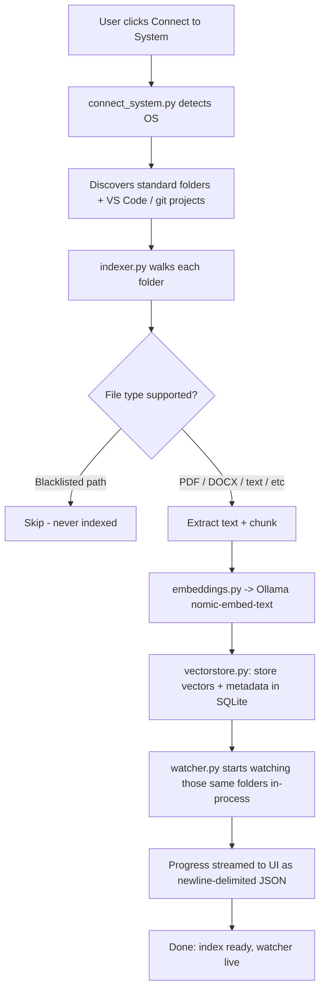
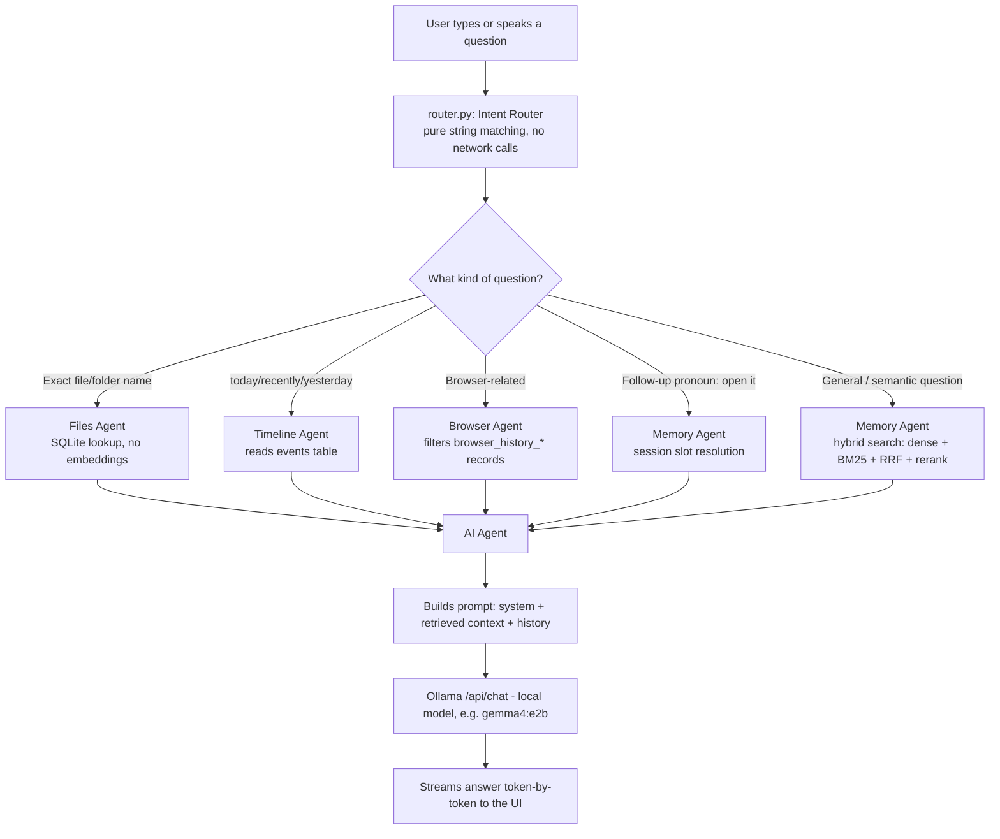
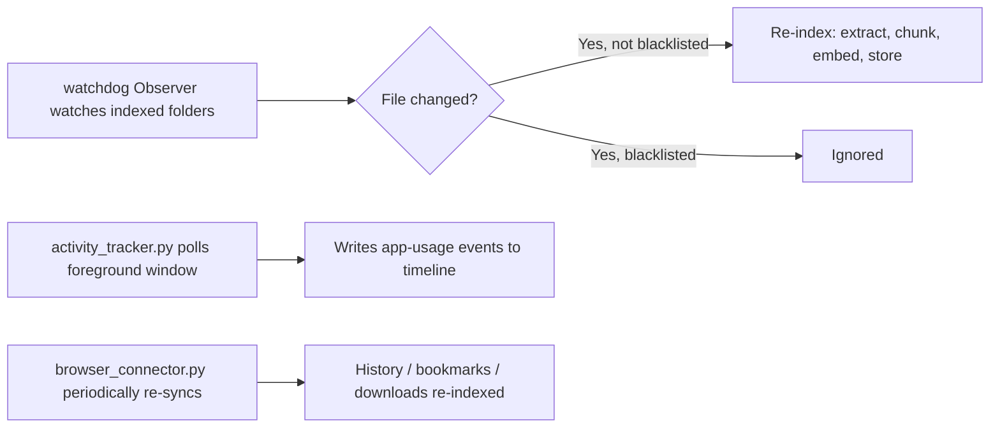
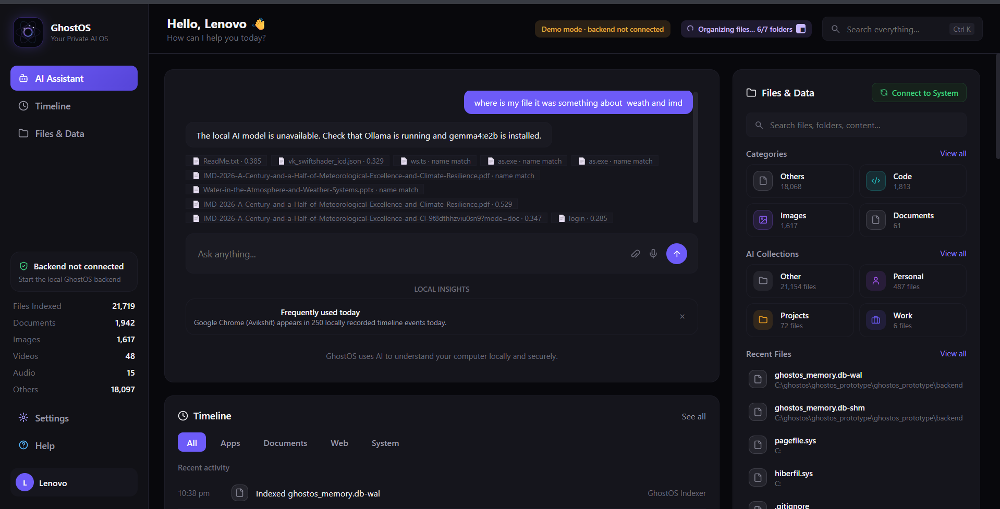
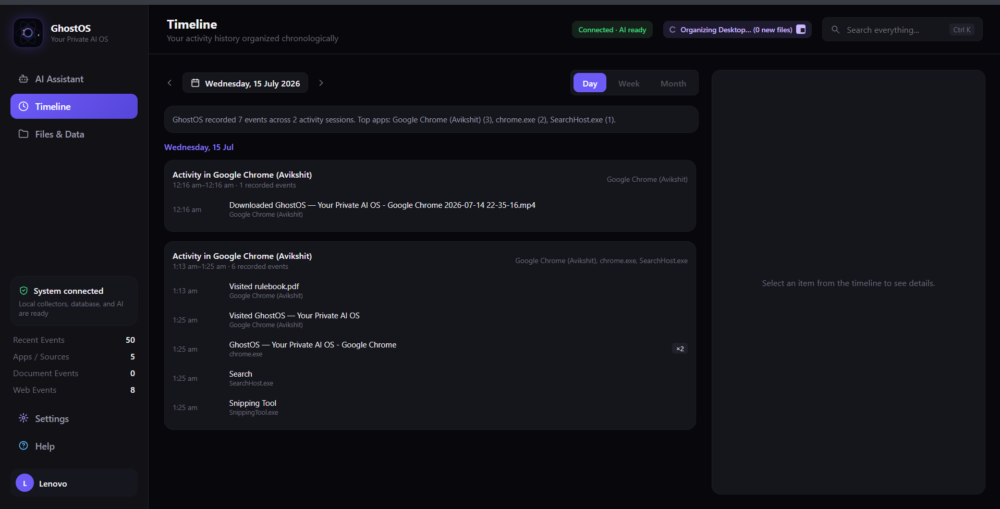
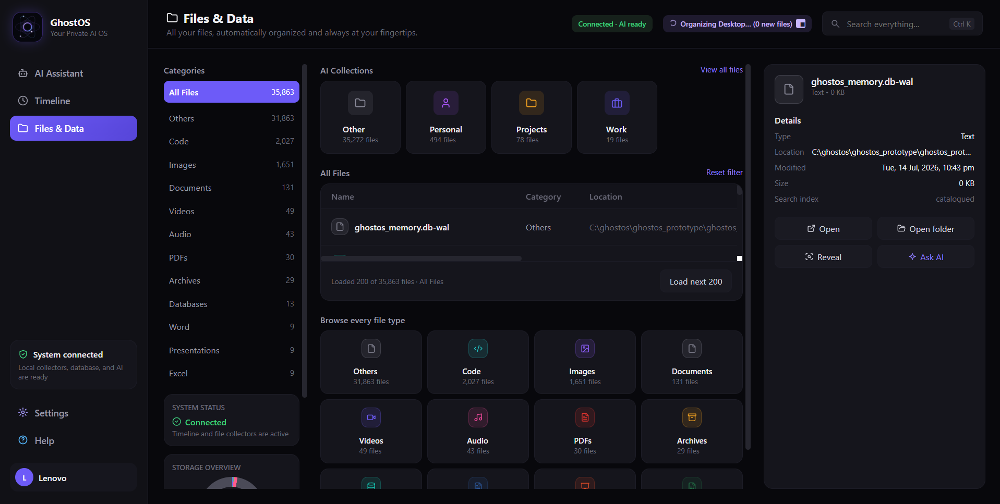

# GhostOS

**Your Private AI OS** — an ambient, offline-first "second brain" that watches your own machine (files, browser history, activity) and lets you talk to your own history in natural language, with zero cloud calls.

---

## 1. Short Description

GhostOS is a local desktop assistant that indexes your files, browser history, and activity, then answers questions about them using a locally-running LLM (via Ollama). Everything — capture, embedding, storage, and inference — runs on your machine. No account, no cloud API, no telemetry.

---

## 2. Problem Statement

You've seen the file, the link, the stat, the conversation snippet — but three days later it's gone, because nothing was capturing it in the first place. Search engines only index what's public. Notes apps only have what you deliberately wrote down. And the AI tools that *could* stitch this together — Recall-style tools, cloud copilots — require sending your screen, files, or browsing history to someone else's server.

GhostOS exists for the narrow but real gap in between: a system that remembers everything it's allowed to see, and never has a reason to send that data anywhere.

---

## 3. Solution Overview

GhostOS runs a local Flask backend plus a single-file offline web UI. On first run, **Connect to System** auto-discovers your standard folders (Desktop, Documents, Downloads, Pictures, Videos, Music) and coding folders (VS Code recent projects, git repos), indexes them, and starts a background file watcher — no manual path entry required.

From there, you just talk to it. An **Intent Router** decides whether a question needs a file lookup, a timeline query, browser history, a remembered conversation, a system status check, or a general AI response, and routes it to the matching agent:

| Agent | Job |
|---|---|
| **Files Agent** | Exact filename/folder lookups (fast, no embeddings) |
| **Timeline Agent** | "What did I do today / recently / yesterday?" |
| **Browser Agent** | Chrome/Edge history, bookmarks, downloads |
| **Memory Agent** | Hybrid semantic search over indexed content + conversation memory (pronoun resolution: "open it") |
| **System Agent** | CPU/RAM/disk/battery monitoring |
| **AI Agent** | Final answer generation via the local LLM |

---

## 4. On-Device AI Explanation

Every AI step in GhostOS runs against a **local Ollama instance** — nothing leaves the machine:

1. **Embedding** — indexed text (files, browser records, activity) is converted to vectors using `nomic-embed-text`, called through Ollama's local `/api/embeddings` endpoint.
2. **Storage** — vectors live in a local **SQLite + numpy** store (`vectorstore.py`), deliberately kept simple ("good for tens of thousands of chunks," with a documented upgrade path to sqlite-vec/LanceDB/Chroma if needed).
3. **Retrieval** — queries use **hybrid search**: dense vector similarity *and* BM25 keyword matching, fused with Reciprocal Rank Fusion, then lexically reranked before anything reaches the LLM.
4. **Generation** — the AI Agent builds a system prompt + retrieved context + rolling conversation history and streams a response token-by-token from a local chat model (`gemma4:e2b` by default), via Ollama's `/api/chat`.
5. **Optional local perception** — OCR (Tesseract, off by default) and speech-to-text (`faster-whisper`, fully offline) can be enabled for scanned documents and voice input; both degrade gracefully if not installed, and no audio or image is ever sent over a network.

A hardcoded blacklist in the indexer skips sensitive paths/filenames (password stores, credential files, etc.) regardless of which folder is selected — this runs underneath every indexing pass, not as an opt-in.

---

## 5. Proper Workflow

### 5.1 First-run: Connect to System



### 5.2 Everyday query flow



### 5.3 Background watching (continuous)



---

## 6. Tech Stack

- **Backend:** Python, Flask
- **Local LLM runtime:** Ollama (`gemma4:e2b` chat model, `nomic-embed-text` embeddings — both configurable)
- **Vector storage / search:** SQLite + numpy, hybrid dense + BM25 retrieval with Reciprocal Rank Fusion
- **File watching:** `watchdog`
- **Text extraction:** `pypdf`, `python-docx`
- **OCR (optional):** `pytesseract`, `Pillow`, `PyMuPDF` (requires local Tesseract binary)
- **Voice / speech-to-text (optional):** `faster-whisper` (fully offline)
- **System monitoring:** `psutil`
- **Browser history connector:** direct local Chrome/Edge SQLite/JSON profile reads (no network calls, no live-tab access yet)
- **Frontend:** single-file `index.html` — hand-rolled utility CSS (no Tailwind CDN dependency, so the UI works fully offline)

---

## 7. Setup Instructions

> Prototype status — tested on Windows. See [Known Limitations](#9-known-limitations--future-scope).

1. **Install Ollama** and pull the required local models:
   ```bash
   ollama pull gemma4:e2b
   ollama pull nomic-embed-text
   ```
2. **Clone the repo** and set up a virtual environment:
   ```bash
   git clone https://github.com/GhostOS1/GhostOS.git
   cd ghostos_prototype/ghostos_prototype
   python -m venv .venv
   .venv\Scripts\activate      # Windows
   pip install -r requirements.txt
   ```
3. **(Optional) OCR support:**
   ```bash
   pip install -r requirements-ocr.txt
   ```
   Also install the [Tesseract Windows executable](https://github.com/UB-Mannheim/tesseract/wiki) separately — GhostOS never downloads it automatically.
4. **(Optional) Voice input:**
   ```bash
   pip install -r requirements-voice.txt
   ```
5. **Start the backend:**
   ```bash
   python app.py
   ```
   or on Windows, use the provided script:
   ```powershell
   ./run_backend.ps1
   ```
6. **Open the UI** — open `index.html` in a browser (it talks to the local Flask server at `http://127.0.0.1:5000` by default).

---

## 8. Usage Instructions

1. Open the app and click **Connect to System** — GhostOS discovers and indexes your standard folders automatically. No path typing required.
2. Watch the live progress bar as it indexes files and starts the background watcher.
3. Ask it things in plain language, e.g.:
   - *"What was that stock site I looked at yesterday?"*
   - *"Show me everything in my Downloads folder from this week."*
   - *"What have I been working on today?"*
   - *"Open the report I was looking at earlier."*
4. Use the **Timeline** and **Collections** panels in the UI to browse indexed activity directly instead of asking.
5. Adjust settings (models, OCR, voice, indexed/excluded folders, action permissions) in `ghostos_settings.json` or via the Settings panel.

---

## 9. Known Limitations & Future Scope

**Current limitations:**
- Windows-first — `activity_tracker.py` uses Windows-specific APIs (`ctypes.windll`) for foreground-window tracking; not yet cross-platform.
- Vector store is SQLite + numpy — fine up to roughly tens of thousands of chunks; heavier use will need a swap to sqlite-vec, LanceDB, or Chroma (the codebase is structured to make that swap isolated).
- No live browser tab access — only *historical* Chrome/Edge data (history, bookmarks, downloads) is read; a live-tab connector would need a browser extension or CDP integration, which isn't implemented yet.
- OCR and voice transcription aren't perfect and are both off/limited by default — accuracy depends on document/audio quality.
- System Agent is monitoring-only right now (CPU/RAM/disk/battery); OS-level actions (shutdown, toggling Bluetooth, etc.) are explicitly out of scope pending a dedicated permissions/safety pass.
- Single-user, single-machine design — no multi-device sync.
- Local storage grows with usage; no automatic retention/pruning policy yet.

**Future scope:**
- Cross-platform activity tracking (macOS/Linux)
- Live browser tab awareness via extension/CDP
- Configurable retention and storage pruning
- Expanded, reviewed action set for the System Agent
- Swappable vector backend for larger indexes

---

## 10. Demo Video

📺 [Watch the demo video](https://drive.google.com/file/d/1sPVpDJCWj4lD2BJ30ri30hHasupe7F47/view)

## 11. Screenshots

**AI Assistant — chat + local insights**


**Timeline — chronological activity history**


**Files & Data — indexed files, categories, and collections**


*Screenshots live in the `screenshots/` folder — drop new ones in there and reference them the same way to add more.*

## 12. License

This project is licensed under the [MIT License](LICENSE) — see the `LICENSE` file for details.

---

**A note on privacy:** GhostOS's core design constraint is that nothing it captures is ever sent off the device. Every indexing, embedding, retrieval, and generation step in this README runs against a local process (Ollama, local SQLite, local OCR/voice models). If a feature ever requires a network call to a third party, that would be a deviation from this design and should be called out explicitly, not assumed.
